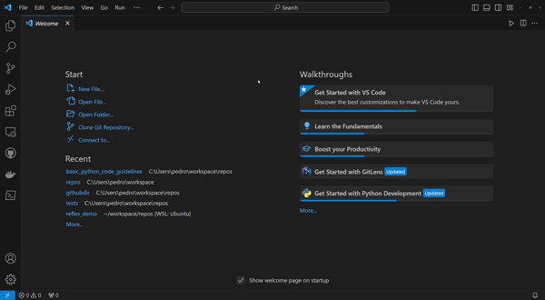

## Setting Up Black and Pylint in Visual Studio Code

1. **Install Python:**
   - Download and install Python from the [official website](https://www.python.org/downloads/).

2. **Install Visual Studio Code:**
   - Download and install Visual Studio Code from the [official website](https://code.visualstudio.com/).

3. **Install Python/ black/ pylint Extension:**
   - Open Visual Studio Code.
   - Go to the Extensions view by clicking on the square icon on the left sidebar or pressing `Ctrl+Shift+X`.
   - Search for "Python" in the Extensions Marketplace and install the one provided by Microsoft.
   - Search for "Black Formatter" in the Extensions Marketplace and install the one provided by Microsoft.
   - Search for "Pylint" in the Extensions Marketplace and install the one provided by Microsoft.

4. **Create a Python Virtual Environment:**
   - Open your project in Visual Studio Code.
   - In the terminal, create a Python virtual environment for your project:
     ```shell
     python -m venv venv
     ```
   - Activate your virtual environment in the terminal:
     ```shell
     .\venv\Scripts\activate  # On Windows
     source venv/bin/activate  # On macOS/Linux
     ```

5. **Install Black and Pylint:**
   - Install Black and Pylint using pip:
     ```shell
     pip install black pylint
     ```

6. **Configure Global User Settings:**
   - Click on "File" in the top-left corner of Visual Studio Code.
   - Choose "Preferences," and then select "Settings."
   - In the settings search box, type: "workbench settings editor" and change the combo box option from "ui" to "json".

7. **Add Configuration for Black and Pylint with Line Length 120:**
   ```json
   {
       "[python]": {
        "editor.formatOnSave": true,
        "editor.defaultFormatter": "ms-python.black-formatter"
        },
        "black-formatter.args": [
            "--line-length=120"
        ],
        "pylint.args": [
            "--max-line-length=120",
        ],
   }
   ```
   
   

8. **Save the settings.json file.**
   - `Ctrl+S`.
9. **Restart VS Code:**
   - Restart Visual Studio Code to ensure that the changes take effect.